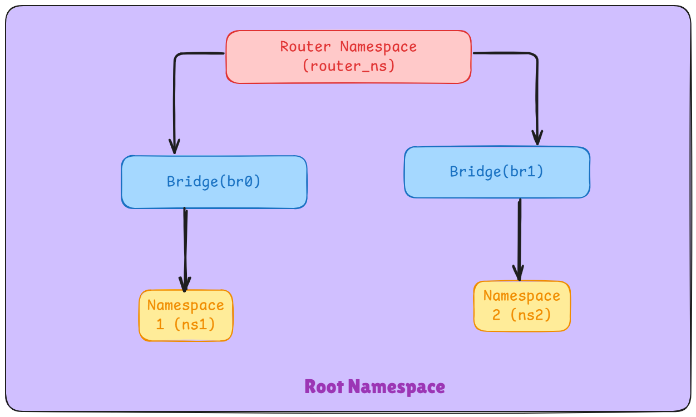

# Linux Network Namespace Simulation

## Main Objective

Create a network simulation with two separate networks connected via a router using Linux network namespaces and bridges.

### Network Bridges

•⁠ ⁠Bridge 0 (br0) •⁠ ⁠Bridge 1 (br1)

### Network Namespaces

•⁠ ⁠Namespace 1 (ns1) - connected to br0 •⁠ ⁠Namespace 2 (ns2) - connected to br1 •⁠ ⁠Router namespace (router-ns) - connects both bridges

## Diagram



### Step 1: Install system pre-requisites

```
sudo apt update && sudo apt upgrade -y
sudo apt install iproute2 net-tools tcpdump -y
sudo apt install build-essential
```

### Step 2: Create Network Namespaces

```
sudo ip netns add ns1
sudo ip netns add ns2
sudo ip netns add router-ns
```

### Verify namespaces:

```
sudo ip netns list
```

### Step 3: Create Network Bridges

```
sudo ip link add br0 type bridge
sudo ip link add br1 type bridge
sudo ip link set br0 up
sudo ip link set br1 up
```

### Verify bridge creation:

```
sudo ip link show type bridge
```

### Step 4: Create Virtual Ethernet Pairs

```

sudo ip link add veth-ns1 type veth peer name veth-br0
sudo ip link add veth-ns2 type veth peer name veth-br1
sudo ip link add veth-router0 type veth peer name veth-br0-router
sudo ip link add veth-router1 type veth peer name veth-br1-router

```

### Step 5: Assign Interfaces to Namespaces

```
sudo ip link set veth-ns1 netns ns1
sudo ip link set veth-ns2 netns ns2
sudo ip link set veth-router0 netns router-ns
sudo ip link set veth-router1 netns router-ns

```

### Step 6: Connect Interfaces to Bridges

```
sudo ip link set veth-br0 master br0
sudo ip link set veth-br1 master br1
sudo ip link set veth-br0-router master br0
sudo ip link set veth-br1-router master br1

```

### Bring up the interfaces:

```
sudo ip link set veth-br0 up
sudo ip link set veth-br1 up
sudo ip link set veth-br0-router up
sudo ip link set veth-br1-router up

```

### Step 7: Assign IP Addresses

```

sudo ip netns exec ns1 ip addr add 192.168.1.2/24 dev veth-ns1
sudo ip netns exec ns1 ip link set veth-ns1 up


sudo ip netns exec ns2 ip addr add 192.168.2.2/24 dev veth-ns2
sudo ip netns exec ns2 ip link set veth-ns2 up


sudo ip netns exec router-ns ip addr add 192.168.1.1/24 dev veth-router0
sudo ip netns exec router-ns ip addr add 192.168.2.1/24 dev veth-router1
sudo ip netns exec router-ns ip link set veth-router0 up
sudo ip netns exec router-ns ip link set veth-router1 up

```

### Enable loopback in all namespaces:

```
sudo ip netns exec ns1 ip link set lo up
sudo ip netns exec ns2 ip link set lo up
sudo ip netns exec router-ns ip link set lo up

```

### Step 8: Enable IP Forwarding

```
sudo ip netns exec router-ns sysctl -w net.ipv4.ip_forward=1

```

### Step 9: Configure Routing

```
sudo ip netns exec ns1 ip route add default via 192.168.1.1

sudo ip netns exec ns2 ip route add default via 192.168.2.1

```

### Step 10: Verify Connectivity

1. Check connectivity between ns1 and router-ns:

```
sudo ip netns exec ns1 ping -c 3 192.168.1.1
```

2. Check connectivity between ns2 and router-ns:

```
sudo ip netns exec ns2 ping -c 3 192.168.2.1

```

3. Check full connectivity between ns1 and ns2:

```
sudo ip netns exec ns1 ping -c 3 192.168.2.2

```

### Step 11: Cleanup

```
sudo ip netns del ns1
sudo ip netns del ns2
sudo ip netns del router-ns

sudo ip link del br0
sudo ip link del br1

sudo ip link del veth-ns1
sudo ip link del veth-ns2
sudo ip link del veth-router0
sudo ip link del veth-router1
```
